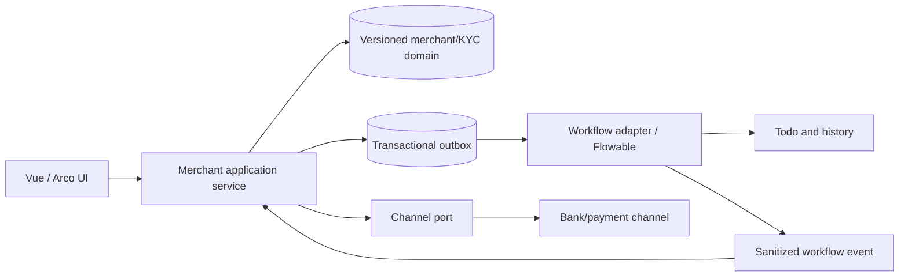

## Context

ContiNew Admin 4.1.0 already supplies identity, role/menu/button permissions, tenant isolation, department-oriented data permission, CRUD scaffolding, dynamic Vue routes, file/S3 storage, Redis, messages, scheduling, logging, masking, field encryption, Liquibase, and exports. It does not contain agent, merchant, KYC onboarding, workflow, channel, payment, ledger, reconciliation, or settlement domain models.

Phase one must add a durable merchant-onboarding approval capability while minimizing framework duplication. Flowable is introduced only as the process engine. ContiNew remains authoritative for users, roles, permissions, tenants, files, messages, and operational audit. The versioned merchant/KYC domain remains authoritative for business data and state.

Stakeholders include agent administrators, merchant operators, merchant reviewers, risk reviewers, channel operations, security/compliance, support, development, QA, and operations.

Visual evidence and source traceability are cataloged in [references/source-requirements.md](references/source-requirements.md).

## Goals / Non-Goals

**Goals:**

- Deliver a modular-monolith foundation for agent management, merchant master, five-step KYC onboarding, review/supplement workflows, channel onboarding, and limit adjustment.
- Use Flowable 7.x for persistent human tasks, candidate groups, timers, history, supplementation, rejection, approval, and process versions.
- Reuse ContiNew authentication, tenant, data permission, file storage, messages, audit, scheduling, and Vue/Arco foundations.
- Keep raw KYC, bank, mobile, credential, attachment, and channel payload data out of Flowable variables and generic logs.
- Provide deterministic business versioning, idempotency, failure recovery, automated tests, and operational diagnostics.

**Non-Goals:**

- LiteFlow or another rule engine in phase one.
- Flowable IDM, Form, CMMN, DMN, REST applications, or commercial UI products.
- Ledger, balances, freezing, split settlement, withdrawal execution, refunds, reconciliation, chargebacks, voucher issuance, or financial posting.
- Microservice decomposition, distributed XA transactions, or a second user/role system.
- Using Flowable process completion as proof of channel or financial success.

## Decisions

### Decision 1: Keep a modular monolith

Add domain and integration modules to the current Maven reactor rather than creating services immediately.

```text
continew-extension-workflow   Flowable adapter, process/task APIs, listeners
continew-merchant             agent, merchant, KYC, onboarding, review, limits
continew-channel              channel ports, adapters, callbacks, state mapping
continew-server               controllers and application assembly
```

**Rationale:** phase-one consistency, transactions, deployment, and operations are simpler in one application; module boundaries remain explicit and can be verified later with Spring Modulith if adopted.

**Alternative rejected:** immediate microservices. It adds distributed consistency, tracing, deployment, and test costs before load or team boundaries justify them.

### Decision 2: Import only the Flowable process starter

Use a Flowable 7.x version proven compatible with Java 17 and Spring Boot 3.3.x and import only the process-engine Spring Boot starter. Disable production automatic schema mutation and manage Flowable schema with reviewed migrations/vendor scripts.

**Rationale:** BPMN process/task/history capabilities are required; IDM, Form, DMN, CMMN and Flowable applications duplicate ContiNew or exceed phase-one scope.

**Alternative rejected:** custom approval tables only. They appear cheaper for one approval but become expensive for supplementation loops, candidate groups, timers, transfer, concurrent completion, process history, and definition versioning.

### Decision 3: Hide Flowable behind project-owned ports

Business modules depend on `WorkflowService`, commands, and DTOs owned by this project. Only the workflow extension may use Flowable `RuntimeService`, `TaskService`, `RepositoryService`, and `HistoryService`.

```java
interface WorkflowService {
    WorkflowRef start(StartWorkflowCommand command);
    void claim(ClaimTaskCommand command);
    void complete(CompleteTaskCommand command);
    PageResult<WorkflowTaskDTO> pageTodo(WorkflowTaskQuery query);
    PageResult<WorkflowTaskDTO> pageDone(WorkflowTaskQuery query);
}
```

**Rationale:** limits engine coupling, centralizes tenant/permission/variable validation, and enables consistent idempotency and audit.

### Decision 4: Domain business state is the source of truth

Flowable owns process definition, instance, task, assignment, timer, and process history. Domain tables own merchant lifecycle, KYC version, review result, channel sub-states, requested/effective limits, and all sensitive data.



**Rationale:** process state cannot express channel or financial truth and Flowable history must not become a second KYC database.

### Decision 5: Enforce a Flowable variable allowlist

Allowed variables are simple identifiers and non-sensitive routing metadata:

```text
tenantId, merchantId, applicationId, kycVersion, channelCode,
applicantId, owningAgentId, riskLevel, requiresSupplement
```

Rejected variables include raw identity/mobile/bank values, passwords, KYC JSON, serialized domain objects, binary data, permanent attachment URLs, channel keys, and complete channel payloads.

Process `businessKey` format:

```text
{tenantId}:{businessType}:{businessId}:{businessVersion}
```

### Decision 6: Use domain versioning and optimistic concurrency

KYC saves create or update a draft under an optimistic version. Final submission freezes a KYC version. Supplementation creates a new version linked to the rejected version. Review and channel commands include the exact business version.

Core business tables:

| Table | Purpose |
|---|---|
| `biz_agent` | Agent hierarchy and lifecycle |
| `biz_agent_pricing_version` | Immutable parent/subordinate pricing boundaries |
| `biz_merchant` | Merchant master and ownership |
| `biz_onboarding_application` | Merchant/channel application and normalized status |
| `biz_kyc_version` | Versioned legal, person, shareholder, settlement and pricing references |
| `biz_kyc_attachment` | Private file object references, evidence type and hash |
| `biz_review_record` | Human/AI decisions and reviewed KYC version |
| `biz_workflow_instance` | Business object to Flowable process mapping |
| `biz_limit_adjustment` | Original/requested/effective limit and process/channel state |
| `biz_outbox_event` | Reliable cross-boundary commands/events |
| `biz_channel_event` | Raw/sanitized channel event identity and normalized mapping result |

### Decision 7: Coordinate domain and Flowable with idempotent outbox

Business mutations and outbox events commit in one domain transaction. An idempotent worker sends workflow/channel commands and records completion. Inbound workflow events and channel callbacks use deterministic keys and optimistic state transitions.

**Rationale:** avoids XA and permits recovery when Flowable or a channel is unavailable after the domain transaction commits.

**Alternative rejected:** call Flowable and domain writes in an assumed single transaction everywhere. This is fragile across asynchronous execution, engine jobs, retries, and future service extraction.

### Decision 8: Map ContiNew identity and scope into tasks

- Flowable tenant ID maps to ContiNew tenant ID.
- Candidate groups use configured ContiNew role codes.
- Assignees use ContiNew user IDs represented as strings.
- Task queries apply both functional permission and agent-tree/merchant data scope.
- Process variables do not grant authorization; every action reloads business scope.
- Disabled users/agents are excluded and existing assignments trigger configured reassignment/escalation.

### Decision 9: Keep KYC encrypted and attachments private

Complete sensitive fields are encrypted with external versioned keys. Normalized keyed hashes support equality/uniqueness where approved. Masked values are stored or derived for ordinary responses. Privileged reveal requires permission, business scope, reason, step-up authentication, no-store responses, and immutable audit.

Attachments use X File Storage/S3 private objects with MIME/content validation, size/count limits, hash, malware scan, and short-lived access. Channel adapters stream authorized objects or use channel-scoped temporary URLs.


### Decision 10: Channel adapters own transport; domain owns state

Each adapter handles channel DTOs, signing/encryption, timeout, and response parsing. A versioned mapping converts raw channel events into independent domain sub-states. Callbacks are verified and deduplicated before state change. Uncertain non-idempotent submissions are queried by business serial before resend.

### Decision 11: Process definitions are versioned and tested

Process keys remain stable; BPMN resources are immutable per deployment. New instances use the latest approved version. In-flight instances continue on their original version unless an explicit migration is tested and approved. BPMN contract tests verify node IDs, candidate groups, variables, boundary timers, and all terminal paths.

Initial process definitions:

```text
merchant-onboarding-review-v1
  submit -> optional AI evaluation -> human review
  human review -> approve | reject | request supplement
  supplement -> resubmit -> human review

merchant-limit-adjustment-v1
  submit -> human review -> approved/rejected
  approved -> channel submit/query -> effective/failed
```

### Decision 12: Testing uses real infrastructure boundaries

- Unit tests cover state transitions, pricing boundaries, variable allowlist, masking, and mappings.
- Testcontainers starts supported database and Redis versions.
- Flowable integration tests deploy BPMN and exercise all paths and concurrent completion.
- WireMock simulates signed callbacks, duplicate/late events, timeouts, malformed payloads, and uncertain responses.
- Frontend component/E2E tests cover wizard recovery, permission visibility, conflict handling, masked/reveal behavior, and task actions.

## Risks / Trade-offs

- **[Dependency convergence] Flowable and ContiNew may bring incompatible MyBatis/Jackson/Spring transitive versions** → Pin a proven Flowable 7.x patch, run Maven dependency convergence, and execute boot/database tests before domain work.
- **[Additional schema and operations] Flowable adds runtime/history/job tables** → Use a dedicated schema or prefix, reviewed migrations, retention policy, backups, and job-executor monitoring.
- **[Dual-state drift] Domain and process states may diverge** → Use outbox/idempotency, reconciliation jobs, invariant dashboards, and repair commands instead of direct table edits.
- **[Sensitive leakage] Variables, logs, errors, exports, or files may duplicate KYC** → Enforce allowlists, endpoint logging exclusions, secret scanning, response masking, access audit, and automated database/log scans.
- **[Process-version migration] In-flight instances may not fit a new BPMN definition** → Default to continue on original version and require explicit migration compatibility tests.
- **[Agent-tree complexity] ContiNew department scope is not equivalent to agent scope** → Implement an explicit agent closure/path model and business authorization service.
- **[Open-source licensing] ContiNew Starter carries LGPL obligations while Flowable is Apache-2.0** → Maintain an SBOM, legal review, notices, source-change tracking, and dependency policy before distribution.

## Migration Plan

1. Establish dependency and startup proof with Flowable process starter, isolated schema/prefix, and automatic schema update disabled for production.
2. Add Liquibase domain migrations, agent-tree indexes, workflow mapping, outbox, channel-event tables, encryption-key references, and rollback scripts.
3. Implement workflow port, variable allowlist, ContiNew identity/tenant bridge, task authorization, process deployment verification, and task center APIs.
4. Implement agent/merchant domain and Vue forms behind disabled feature flags.
5. Implement KYC wizard, private attachments, encryption/masking, draft versioning, and safe logging behind feature flags.
6. Deploy and test `merchant-onboarding-review-v1`, then enable for test tenants/channels only.
7. Add channel adapter/callback polling and gradually enable one test channel with synthetic data.
8. Add limit-adjustment process after onboarding invariants and operational repair procedures pass acceptance.
9. Remove feature flags per tenant only after security, migration, concurrency, callback, and disaster-recovery tests pass.

### Rollback

- Disable phase-one feature flags and block creation of new process instances.
- Allow active instances to complete or suspend them under an approved operations runbook.
- Stop channel workers/job executors only after outbox and callback queues are reconciled.
- Roll application code back while retaining additive domain and Flowable tables; do not drop history during operational rollback.
- Use compensating domain commands for incorrect state; never rewrite Flowable/domain history manually.

## Open Questions

- Which Flowable 7.x patch passes dependency convergence with Spring Boot 3.3.12 and the current ContiNew dependency set?
- Which roles may approve their own agent branch, and which require cross-agent or platform review?
- Is AI evaluation advisory only in all phase-one cases, or may a configured low-risk path bypass a human task?
- What are the exact channel-specific evidence formats, size limits, expiry rules, and callback state maps?
- What are the limit minimum, maximum, rounding, withdrawal, and expiry rules?
- What key-management service and national/commercial algorithms are approved for each sensitive field?
- What retention periods apply to KYC, Flowable history, audits, exports, and attachments?
- Which task deadlines, escalation groups, and notification channels are required?
