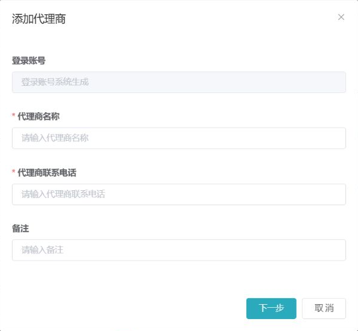

## ADDED Requirements

### Requirement: Agent list is scoped and searchable
**Trace ID:** FR-AGT-001

The system SHALL allow an authorized agent administrator to query agents by agent ID, name, and status, and SHALL return only the current agent and authorized descendants.

#### Scenario: Query authorized descendants
- **GIVEN** the signed-in user administers an agent subtree
- **WHEN** the user queries the agent list with valid filters
- **THEN** the system returns only matching agents in that subtree with stable pagination

#### Scenario: Reject sibling-agent enumeration
- **GIVEN** an agent ID belongs to a sibling or unrelated subtree
- **WHEN** the user supplies that ID through a URL or API parameter
- **THEN** the service returns no protected agent data and records the denied access attempt

### Requirement: Direct subordinate agent can be created
**Trace ID:** FR-AGT-002

The system SHALL create a new agent only as a direct subordinate of the current authorized agent, SHALL generate a unique login account, and SHALL validate required name and contact fields.

#### Scenario: Create direct subordinate
- **GIVEN** the user has `agent:create` permission
- **WHEN** the user submits valid agent name and contact data
- **THEN** the system creates one direct subordinate and returns its generated account without returning a password

#### Scenario: Reject parent-agent tampering
- **GIVEN** the submitted request contains a parent agent outside the user's scope
- **WHEN** the create request is processed
- **THEN** the service rejects the request regardless of the client-side form state

### Requirement: Agent profile fields can be edited safely
**Trace ID:** FR-AGT-003

The system SHALL allow permitted users to update agent name, contact phone, and remarks while keeping generated login identity and parent relationship immutable through the ordinary edit operation.

#### Scenario: Update allowed profile fields
- **GIVEN** the user can update the target subordinate agent
- **WHEN** the user changes allowed profile fields with valid values
- **THEN** the system atomically persists the changes and records before-and-after values

#### Scenario: Failed validation does not partially update
- **GIVEN** one or more submitted fields are invalid
- **WHEN** the update request is processed
- **THEN** no agent field is changed

### Requirement: Agent-tree authorization is enforced server-side
**Trace ID:** FR-AGT-004

The system MUST enforce agent-tree scope in service and data-access layers in addition to ContiNew tenant isolation and button permissions.

#### Scenario: Authorized descendant access
- **GIVEN** the target agent is a descendant of the user's agent
- **WHEN** the user performs an authorized read or update action
- **THEN** the action is evaluated against the user's functional permission and descendant scope

#### Scenario: Tenant scope does not imply agent scope
- **GIVEN** two unrelated agents share the same ContiNew tenant
- **WHEN** one agent requests the other's protected data
- **THEN** the service denies access even though the tenant IDs match

### Requirement: Agent lifecycle is controlled
**Trace ID:** FR-AGT-005

The system SHALL allow authorized users to enable or disable subordinate agents, SHALL prevent an agent from disabling itself through the subordinate-management operation, and SHALL require a reason and confirmation.

#### Scenario: Disable subordinate agent
- **GIVEN** the target is an enabled subordinate agent
- **WHEN** an authorized administrator confirms disablement with a reason
- **THEN** new logins are rejected and existing sessions are revoked according to the configured security policy

#### Scenario: Prevent self-disable
- **GIVEN** the target agent is the signed-in user's own agent
- **WHEN** the user attempts to disable it from subordinate management
- **THEN** the service rejects the operation

### Requirement: Agent password reset is privileged and audited
**Trace ID:** FR-AGT-006

The system MUST protect password reset with an independent permission, explicit confirmation, secure credential generation or reset flow, session revocation, and immutable audit logging.

#### Scenario: Reset subordinate password
- **GIVEN** the operator has password-reset permission for the subordinate agent
- **WHEN** the reset is confirmed
- **THEN** the system resets the credential without exposing plaintext in responses or logs and revokes affected sessions

### Requirement: Promotion code is bound to agent ownership
**Trace ID:** FR-AGT-007

The system SHALL generate a unique promotion code or QR reference for an agent and MUST prevent a client from changing the bound owning agent during merchant registration.

#### Scenario: Register from active promotion code
- **GIVEN** an active agent promotion code
- **WHEN** a merchant registration begins from that code
- **THEN** the registration is bound to the code's server-resolved agent

#### Scenario: Disabled promotion code
- **GIVEN** the owning agent or promotion code is disabled
- **WHEN** a new registration attempts to use it
- **THEN** the system refuses to create a new ownership relationship

### Requirement: Agent pricing is bounded and versioned
**Trace ID:** FR-AGT-008

The system SHALL support channel-product pricing for percentage costs, fixed per-transaction fees, and profit-sharing ratios, and MUST reject pricing outside the parent agent's effective boundary.

#### Scenario: Configure pricing within parent boundary
- **GIVEN** a parent pricing version is effective
- **WHEN** a subordinate pricing version is submitted within all permitted bounds
- **THEN** the system stores a new immutable pricing version with an explicit effective time

#### Scenario: Reject pricing outside boundary
- **GIVEN** a submitted rate or share exceeds the parent boundary
- **WHEN** the pricing request is validated
- **THEN** the system rejects the entire pricing version

### Requirement: Merchant defaults are inherited without rewriting history
**Trace ID:** FR-AGT-009

The system SHALL allow an agent to configure default channel products and merchant pricing, and SHALL copy the effective defaults into a new merchant onboarding draft without changing existing merchant history.

#### Scenario: Apply current defaults to new merchant
- **GIVEN** an effective merchant-default version exists
- **WHEN** a new merchant onboarding draft is created for the agent
- **THEN** the draft receives a traceable copy of those defaults

### Requirement: Agent changes are auditable
**Trace ID:** FR-AGT-010

The system MUST record the operator, tenant, agent scope, timestamp, reason, result, and sanitized before-and-after values for agent profile, lifecycle, password, pricing, and merchant-default operations.

#### Scenario: Audit pricing change
- **GIVEN** an agent pricing version is created or superseded
- **WHEN** the operation completes
- **THEN** an audit record identifies both versions without storing sensitive credentials
