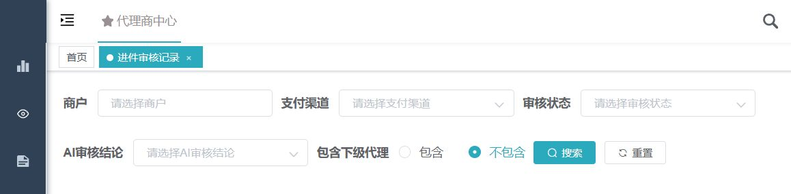

## ADDED Requirements

### Requirement: Flowable is isolated behind a workflow port
**Trace ID:** WF-001

The system SHALL integrate a Flowable 7.x process-engine starter behind a project-owned workflow service interface, and merchant/channel modules MUST NOT call Flowable runtime, task, identity, or history services directly.

#### Scenario: Start workflow through domain port
- **GIVEN** a business service has an approved workflow command
- **WHEN** it requests workflow start
- **THEN** the workflow adapter creates or returns the process instance without exposing Flowable entities to the business module

### Requirement: ContiNew identity remains authoritative
**Trace ID:** WF-002

The system SHALL use ContiNew user IDs, role codes, permissions, tenant IDs, and agent-tree authorization for task resolution; Flowable IDM SHALL NOT be used as a second identity store.

#### Scenario: Resolve candidate group
- **GIVEN** a BPMN user task references a configured ContiNew role code
- **WHEN** eligible assignees are resolved
- **THEN** only enabled ContiNew users with that role and authorized business scope can view or claim the task

### Requirement: Process instance maps to a versioned business object
**Trace ID:** WF-003

The system SHALL persist a unique mapping among tenant, business type, business ID, business version, BPMN process-definition key/version, process-instance ID, and workflow status.

#### Scenario: Duplicate process start
- **GIVEN** a process mapping already exists for the same tenant, business object, version, and process key
- **WHEN** the start command is retried
- **THEN** the workflow adapter returns the existing mapping and does not start another process

### Requirement: Task center is scope-aware
**Trace ID:** WF-004

The system SHALL provide todo, claimed, completed, and process-history views with filtering, pagination, overdue indicators, and server-side tenant/agent/business authorization.

#### Scenario: View todo list
- **GIVEN** the user belongs to a candidate role and has access to the task's merchant
- **WHEN** the user opens the todo list
- **THEN** the task is returned with masked business summary, process node, received time, and due time

#### Scenario: Candidate role without merchant scope
- **GIVEN** the user has the candidate role but not access to the task's merchant branch
- **WHEN** todo tasks are queried
- **THEN** the task is not returned

### Requirement: Approval actions are explicit and auditable
**Trace ID:** FR-REV-003, FR-REV-004

The workflow SHALL support approve, reject, request-supplement, resubmit, claim, unclaim, and authorized transfer actions with action-specific permissions and required opinions.

#### Scenario: Request supplementation
- **GIVEN** a reviewer identifies missing or invalid material
- **WHEN** the reviewer submits a supplement action with issue codes and opinion
- **THEN** the system records the review action and creates the configured supplement task without mutating the submitted KYC version

#### Scenario: Reject without required opinion
- **GIVEN** rejection requires an opinion
- **WHEN** a reviewer submits rejection without one
- **THEN** neither the business review record nor Flowable task is completed

### Requirement: AI and human decisions remain independent
**Trace ID:** FR-REV-002

The system SHALL store AI result, model/rule version, evidence summary, and timestamp independently from human task action, and AI output MUST NOT complete or overwrite a human approval unless an explicitly approved policy states otherwise.

#### Scenario: AI passes but human rejects
- **GIVEN** AI evaluation is pass
- **WHEN** an authorized human reviewer rejects with a valid reason
- **THEN** the human workflow follows the reject path while retaining both decisions

### Requirement: Review uses immutable KYC version
**Trace ID:** FR-REV-005

Every review task SHALL identify the exact KYC version being reviewed and SHALL provide a field/attachment difference against the prior submitted version for supplement reviews.

#### Scenario: Review supplemented version
- **GIVEN** version 4 supplements rejected version 3
- **WHEN** the review task is opened
- **THEN** the UI displays sanitized changes from version 3 to 4 and the reviewer action records version 4

### Requirement: Concurrent task completion is rejected safely
**Trace ID:** FR-REV-006

The system MUST use task/business version checks so that only one valid completion of a task or business decision succeeds.

#### Scenario: Two reviewers complete the same task
- **GIVEN** two reviewers opened the same uncompleted task
- **WHEN** both submit different actions
- **THEN** one transaction succeeds and the other receives a conflict without overwriting business state

### Requirement: Domain business state is authoritative
**Trace ID:** WF-005

Flowable SHALL own process/task state only; merchant, KYC, channel, limit, amount, and lifecycle states SHALL be read and changed through domain services with their own validation and audit records.

#### Scenario: Flowable process reaches end event
- **GIVEN** the process engine reaches an end event
- **WHEN** domain completion conditions are not satisfied
- **THEN** the system records an inconsistency and SHALL NOT infer a successful business outcome from process completion alone

### Requirement: Workflow and domain changes recover from partial failure
**Trace ID:** WF-006

The system SHALL use a same-database transaction where proven safe or a transactional outbox with idempotent consumers to coordinate domain decisions and Flowable commands without distributed XA transactions.

#### Scenario: Domain commit succeeds before workflow command
- **GIVEN** a domain decision and outbox event are committed
- **WHEN** Flowable is temporarily unavailable
- **THEN** the event remains retryable and later execution is idempotent

### Requirement: BPMN versions are controlled
**Trace ID:** WF-007

The system SHALL deploy BPMN definitions with stable keys, immutable versioned resources, deployment metadata, compatibility tests, and an explicit policy for in-flight instances.

#### Scenario: Deploy new process version
- **GIVEN** version 1 has active instances
- **WHEN** version 2 is deployed
- **THEN** new instances use version 2 while version 1 instances continue or migrate only under an approved migration plan

### Requirement: Timers and notifications are idempotent
**Trace ID:** WF-008

The system SHALL support due dates, overdue escalation, reminders, and ContiNew message notifications without creating duplicate notifications or duplicate business actions.

#### Scenario: Reminder job retries
- **GIVEN** a reminder send attempt returns an uncertain result
- **WHEN** the reminder job retries
- **THEN** a notification idempotency key prevents duplicate user messages

### Requirement: Workflow history is retained and sanitized
**Trace ID:** FR-REV-007

The system SHALL retain process definition/version, nodes, assignees, candidate groups, actions, sanitized opinions, timestamps, and business-version references according to policy, and SHALL exclude raw KYC and credentials.

#### Scenario: Export approval history
- **GIVEN** an authorized auditor requests process history
- **WHEN** the history is exported
- **THEN** it contains the approval chain and business-version references but no complete identity number, bank account number, password, or permanent attachment URL
