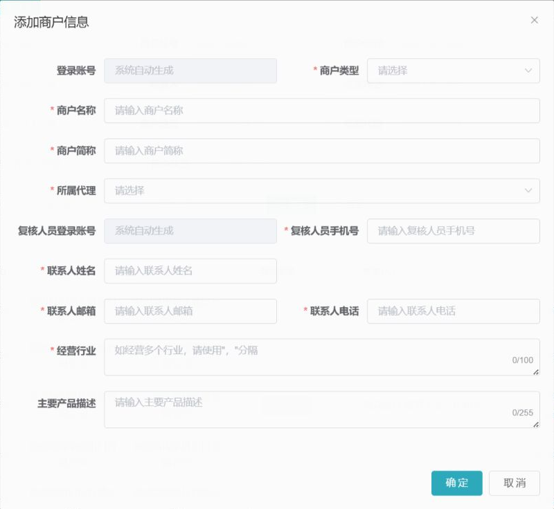

## ADDED Requirements

### Requirement: Merchant master is searchable within agent scope
**Trace ID:** FR-MER-001

The system SHALL support combined search by merchant ID, login account, full name, short name, contact, legal representative, merchant type, owning agent, channel, status, and creation range while enforcing tenant and agent-tree scope.

#### Scenario: Combined merchant query
- **GIVEN** the user has merchant-list permission in an agent subtree
- **WHEN** multiple valid filters are applied
- **THEN** the system returns a stable page of matching authorized merchants without duplication or omission

### Requirement: Merchant summary exposes actionable state
**Trace ID:** FR-MER-002

The merchant list SHALL expose master status, merchant type, owning agent, current channels, effective pricing summary, creation time, and only those actions permitted for the current user and state.

#### Scenario: Action availability follows state and permission
- **GIVEN** a merchant row in a known lifecycle and channel state
- **WHEN** the list is rendered
- **THEN** basic-data, onboarding, limit-adjustment, and lifecycle actions appear only when both state and permission permit them

### Requirement: Merchant can be created with generated identities
**Trace ID:** FR-MER-003, FR-MER-004

The system SHALL create a merchant with merchant type, legal/full name, short name, owning agent, reviewer phone, contact information, industry, and product description, and SHALL generate unique merchant-operator and reviewer login accounts.

#### Scenario: Create valid merchant
- **GIVEN** the user can create merchants for the selected agent
- **WHEN** all required fields pass validation
- **THEN** exactly one merchant and its distinct operator and reviewer identities are created atomically

#### Scenario: Reject identical operator and reviewer identity
- **GIVEN** generated or supplied identity information would bind the same account to both duties
- **WHEN** merchant creation is processed
- **THEN** the service rejects the creation or generates distinct identities according to policy

### Requirement: Merchant legal subject is unique
**Trace ID:** FR-MER-005

The system MUST detect duplicate legal subjects using normalized legal identifiers and business uniqueness rules, including concurrent submissions.

#### Scenario: Concurrent duplicate creation
- **GIVEN** two requests attempt to create the same legal subject concurrently
- **WHEN** both transactions reach persistence
- **THEN** at most one active merchant master is created and the other request receives a deterministic duplicate result

### Requirement: Certified identity fields are protected
**Trace ID:** FR-MER-006

The system SHALL lock ownership and certified identity fields according to lifecycle and channel state, and MUST route legal representative, legal identifier, or settlement-account changes through re-verification instead of ordinary profile editing.

#### Scenario: Change certified legal identity
- **GIVEN** a merchant has an approved channel onboarding
- **WHEN** an operator requests a legal identity change
- **THEN** the ordinary update endpoint refuses direct overwrite and creates a `MERCHANT_REVERIFICATION` request that
  reuses `merchant-onboarding-review-v1` without storing raw certified values in the request or workflow variables

### Requirement: Merchant lifecycle controls downstream operations
**Trace ID:** FR-MER-007

The system SHALL maintain merchant master lifecycle independently from channel onboarding state and SHALL restrict new onboarding, transaction, or settlement operations when the merchant is disabled according to policy.

#### Scenario: Disable merchant
- **GIVEN** an authorized user provides a valid disable reason
- **WHEN** the merchant is disabled
- **THEN** the system preserves historical records and blocks configured new operations without rewriting channel history

### Requirement: Channel and pricing summary remains independent
**Trace ID:** FR-MER-008

The system SHALL display each merchant's channel relationship and pricing version separately from merchant master status.

#### Scenario: Merchant with multiple channel states
- **GIVEN** a merchant has different onboarding states across channels
- **WHEN** its summary is queried
- **THEN** each channel state and effective pricing reference is returned independently

### Requirement: Limit-adjustment actions follow eligibility
**Trace ID:** FR-MER-009

The system SHALL expose limit-adjustment and adjustment-history actions only for merchants, channels, and platforms that meet configured eligibility rules.

#### Scenario: Ineligible channel hides adjustment action
- **GIVEN** a merchant channel is not successfully onboarded or does not support adjustment
- **WHEN** merchant actions are resolved
- **THEN** no adjustment submission action is offered and direct API use is rejected

### Requirement: Merchant access is isolated server-side
**Trace ID:** FR-MER-010

The system MUST prevent cross-merchant and cross-agent access for list, detail, update, onboarding, attachment, export, and workflow-task endpoints.

#### Scenario: Enumerate merchant detail ID
- **GIVEN** the requested merchant belongs to an unauthorized agent branch
- **WHEN** a user requests its detail by ID
- **THEN** the service reveals no merchant or sensitive-field existence information

### Requirement: Merchant field constraints are deterministic
**Trace ID:** BR-MER-001

The system SHALL apply the same normalized validation rules in UI and service layers, including a maximum of 100 characters for industry and 255 characters for product description.

#### Scenario: Reject overlong description
- **GIVEN** a description exceeds its configured maximum
- **WHEN** the merchant request is submitted
- **THEN** the service rejects it without partial persistence
