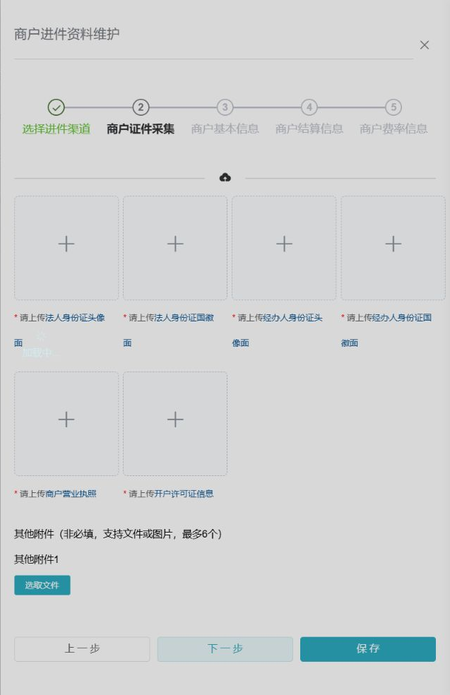

## ADDED Requirements

### Requirement: Available channels are resolved by authorization
**Trace ID:** FR-ONB-001

The system SHALL list only channels that are enabled, supported for the merchant type, and authorized for the owning agent at the time a draft is created or resumed.

#### Scenario: List eligible channels
- **GIVEN** a merchant and owning agent with configured channel products
- **WHEN** an authorized operator starts onboarding
- **THEN** the system returns only currently eligible channels with their requirement versions

#### Scenario: Disabled channel cannot be submitted
- **GIVEN** a channel becomes disabled after a draft was saved
- **WHEN** the operator attempts final submission
- **THEN** submission is rejected and the draft remains available for correction

### Requirement: Historical KYC can be reused with provenance
**Trace ID:** FR-ONB-002

The system MAY copy authorized KYC data from another version of the same merchant, but SHALL show the source channel, source version, update time, copied fields, and fields requiring re-confirmation.

#### Scenario: Reuse same-merchant KYC
- **GIVEN** an authorized prior KYC version exists for the merchant
- **WHEN** the operator selects it as a source
- **THEN** the system copies only reusable fields into the draft and revalidates completeness and expiry

#### Scenario: Reject cross-merchant reuse
- **GIVEN** the selected source belongs to another merchant
- **WHEN** reuse is requested by ID manipulation
- **THEN** the service rejects the request and exposes no source data

### Requirement: Five-step onboarding sequence is controlled
**Trace ID:** FR-ONB-003

The system SHALL provide ordered steps for channel selection, evidence collection, merchant/KYC data, settlement account, and pricing/operating-platform proof, and SHALL prevent final submission until every required step validates.

#### Scenario: Navigate back without losing draft data
- **GIVEN** valid unsent data was entered in an earlier step
- **WHEN** the operator navigates backward and forward before final submission
- **THEN** the client retains local changes and saved server-side data remains available

#### Scenario: Skip invalid step
- **GIVEN** the current step lacks required information
- **WHEN** the operator attempts to advance or submit
- **THEN** the system identifies the invalid fields and does not mark the step complete

### Requirement: Required identity and business evidence is collected
**Trace ID:** FR-ONB-004

The system SHALL collect channel-configured evidence including legal-representative identity sides, operator identity sides, business license, settlement-account evidence, and optional supplemental attachments.

#### Scenario: Missing required evidence
- **GIVEN** a channel requirement version marks an evidence type as mandatory
- **WHEN** final validation runs without that evidence
- **THEN** submission is rejected with the missing evidence type and requirement version

### Requirement: Attachment content is validated and private
**Trace ID:** FR-ONB-005

The system MUST validate actual MIME type, extension, size, count, hash, malware-scan result, and image/document readability on the server, and SHALL store accepted files in private object storage.

#### Scenario: Reject disguised executable
- **GIVEN** a file uses an allowed extension but its detected content is disallowed
- **WHEN** upload validation runs
- **THEN** the system rejects and quarantines or removes the upload without exposing a public URL

#### Scenario: Read attachment using temporary authorization
- **GIVEN** an authorized reviewer requests an attachment
- **WHEN** access is granted
- **THEN** the system issues a short-lived access mechanism and records the viewer and object ID

### Requirement: Legal subject data is validated
**Trace ID:** FR-ONB-006

The system SHALL maintain legal name, normalized social-credit identifier, license issue and expiry dates, business scope, registered address, operating region, and detailed operating address in a versioned KYC record.

#### Scenario: License expiry precedes issue date
- **GIVEN** an expiry date earlier than the issue date
- **WHEN** KYC validation runs
- **THEN** the KYC version is rejected as invalid

### Requirement: Legal representative, operator, and beneficiary data is validated
**Trace ID:** FR-ONB-007

The system SHALL maintain legal representative, operator, and beneficial-owner determination with normalized identity fields, mobile information, document validity dates, and conditional required-field rules.

#### Scenario: Expired identity document
- **GIVEN** a required person's identity document is expired at submission time
- **WHEN** final validation runs
- **THEN** the system blocks submission and identifies the affected role without returning the full identity number

### Requirement: Shareholder structure is versioned
**Trace ID:** FR-ONB-008

The system SHALL support individual and corporate shareholders, optional population from legal-representative data, configurable ownership validation, and immutable historical versions.

#### Scenario: Add corporate shareholder
- **GIVEN** a merchant requires shareholder disclosure
- **WHEN** a valid corporate shareholder is added
- **THEN** the shareholder is bound to the current KYC version and included in beneficial-owner evaluation

### Requirement: Settlement account is verified
**Trace ID:** FR-ONB-009

The system SHALL support ordinary and accelerated-verification account modes and MUST validate account name, encrypted account number, reserved mobile, bank, and verification result before final submission.

#### Scenario: Settlement verification fails
- **GIVEN** the bank or verification service reports inconsistent account ownership
- **WHEN** the settlement step is validated
- **THEN** the application cannot be finally submitted and the complete account number is not written to logs or Flowable variables

### Requirement: Merchant pricing is captured as a referenced version
**Trace ID:** FR-ONB-010

The onboarding application SHALL reference a pricing version for settlement deposit, enterprise-payment deposit, withdrawal percentage, and fixed fee, and MUST validate it against the owning agent's effective pricing boundary.

#### Scenario: Parent pricing changes during draft
- **GIVEN** the parent pricing boundary changes after the draft was created
- **WHEN** final submission revalidates pricing
- **THEN** the system either accepts the still-valid referenced version or requires the operator to select a valid version

### Requirement: Operating-platform proof supports multiple platforms
**Trace ID:** FR-ONB-011

The system SHALL allow multiple operating-platform records with channel-configured evidence such as store link/QR, platform cash-flow evidence, store identity, certification, order pages, storefront pages, and supplemental material.

#### Scenario: Save two platform records
- **GIVEN** a merchant operates on two supported platforms
- **WHEN** evidence for both platforms is saved
- **THEN** each platform and its evidence remain independently versioned and one does not overwrite the other

### Requirement: Draft is durable and recoverable
**Trace ID:** FR-ONB-012

The system SHALL distinguish client-only edits from server-saved drafts, SHALL support explicit draft save, and SHALL restore the latest saved KYC version after refresh or reauthentication.

#### Scenario: Recover saved draft
- **GIVEN** a draft was saved successfully
- **WHEN** the user signs in again and opens the application
- **THEN** the system restores the latest saved version and its step completion state

#### Scenario: Save conflict
- **GIVEN** another session has saved a newer business version
- **WHEN** an older session attempts to save
- **THEN** optimistic concurrency rejects overwrite and prompts reload or controlled merge

### Requirement: Final preview precedes submission
**Trace ID:** FR-ONB-013

The system SHALL display a final preview of the exact business version, channel, evidence completeness, settlement-account mask, and pricing version before accepting final confirmation.

#### Scenario: Cancel final preview
- **GIVEN** a valid draft reaches final preview
- **WHEN** the operator cancels confirmation
- **THEN** no workflow or channel request is created and the draft remains editable

### Requirement: Final submission is idempotent
**Trace ID:** FR-ONB-014

The system MUST create at most one active onboarding submission for the same tenant, merchant, channel, business version, and idempotency key.

#### Scenario: Repeated final click
- **GIVEN** a final submission request was accepted
- **WHEN** the client repeats the same request because of retry or double click
- **THEN** the system returns the existing application/workflow reference without creating a duplicate

### Requirement: Submitted version is immutable
**Trace ID:** FR-ONB-015

After submission, the submitted KYC version SHALL be immutable; corrections SHALL create a new supplement version linked to the prior version and workflow task.

#### Scenario: Edit submitted KYC directly
- **GIVEN** KYC version 3 is under review
- **WHEN** an ordinary update attempts to change version 3
- **THEN** the service rejects direct mutation and requires a supplement workflow action

### Requirement: Process QR and signing links are short-lived references
**Trace ID:** FR-ONB-016

The system SHALL bind generated process QR codes and signing links to tenant, merchant, application, channel, intended action, and expiry, and MUST prevent ownership tampering.

#### Scenario: Expired signing link
- **GIVEN** a signing link has passed its expiry
- **WHEN** it is opened
- **THEN** the system refuses the action and offers an authorized regeneration path

### Requirement: Onboarding status is traceable across sub-states
**Trace ID:** FR-ONB-017

The system SHALL maintain independent internal states for reporting, agreement signing, card binding, reserve-account opening, and final onboarding outcome, while preserving raw channel codes and normalized mappings.

#### Scenario: Out-of-order callback
- **GIVEN** a newer channel state has already been accepted
- **WHEN** an older valid callback arrives later
- **THEN** the callback is recorded but SHALL NOT regress the normalized state

### Requirement: Flowable contains references, not raw KYC
**Trace ID:** SEC-ONB-001

Flowable process variables MUST be restricted to approved identifiers and non-sensitive routing metadata such as tenant ID, merchant ID, application ID, KYC version, channel code, applicant ID, risk level, and supplement flag.

#### Scenario: Start process from KYC application
- **GIVEN** a versioned KYC application is ready for review
- **WHEN** the workflow is started
- **THEN** Flowable receives `applicationId` and `kycVersion` but not raw identity numbers, bank account numbers, mobile numbers, passwords, full KYC JSON, or permanent attachment URLs

#### Scenario: Reviewer requires full sensitive data
- **GIVEN** a reviewer has a legitimate need and privileged reveal permission
- **WHEN** the reviewer requests an unmasked value
- **THEN** the domain service reauthenticates as configured, temporarily decrypts the value, prevents caching, and writes a reveal audit event
