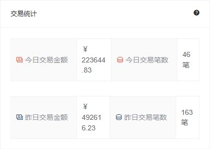

## ADDED Requirements

### Requirement: Workbench exposes scoped onboarding metrics
**Trace ID:** FR-DASH-001

The workbench SHALL show authorized counts for drafts, submitted applications, pending reviews, supplement tasks, channel processing, successes, failures, and overdue tasks with an explicit business timezone and last-updated time.

#### Scenario: Agent views workbench
- **GIVEN** an agent administrator opens the workbench
- **WHEN** metrics are loaded
- **THEN** each metric includes only the agent's authorized subtree and identifies its as-of time

### Requirement: Metric failure is distinct from zero
**Trace ID:** FR-DASH-004

The system SHALL distinguish zero results, loading state, stale cached values, partial failure, and complete failure, and SHALL offer a controlled refresh.

#### Scenario: Metric query fails
- **GIVEN** the metric service times out
- **WHEN** the workbench renders
- **THEN** the affected metric shows unavailable or stale status rather than zero

### Requirement: Workbench supports drill-down
**Trace ID:** FR-DASH-005

Each actionable metric SHALL navigate to an authorized list with corresponding status, tenant, agent scope, and time filters applied.

#### Scenario: Drill into supplement tasks
- **GIVEN** the supplement count is nonzero
- **WHEN** the user activates that metric
- **THEN** the task center opens with supplement-task filters and the same data scope

### Requirement: Messages and task notifications are unified
**Trace ID:** FR-DASH-002, WF-008

The system SHALL use ContiNew messages for assignment, supplementation, approval result, channel failure, overdue escalation, and system-maintenance notifications with read status and idempotency key.

#### Scenario: New task assignment
- **GIVEN** a user becomes an eligible or assigned reviewer
- **WHEN** a new task is created
- **THEN** one notification is generated with a link to the authorized task summary

### Requirement: Operational failure queue is visible
**Trace ID:** OPS-001

The system SHALL expose authorized channel callback failures, uncertain submissions, exhausted retries, workflow/domain inconsistencies, malware-scan failures, and overdue tasks with severity and recovery status.

#### Scenario: Uncertain channel submission
- **GIVEN** a channel submission timed out with unknown outcome
- **WHEN** the operations workbench loads
- **THEN** the event is visible with business reference, next query/retry time, and permitted recovery action

### Requirement: Operational telemetry is correlated
**Trace ID:** NFR-OBS-001

The system SHALL correlate HTTP trace ID, domain command ID, outbox event ID, process-instance ID, task ID, channel business serial number, and scheduled-job execution without recording sensitive payloads.

#### Scenario: Trace failed callback to business application
- **GIVEN** a callback processing error is selected
- **WHEN** an authorized operator opens diagnostic context
- **THEN** the system identifies related application, process, event, and sanitized log records
