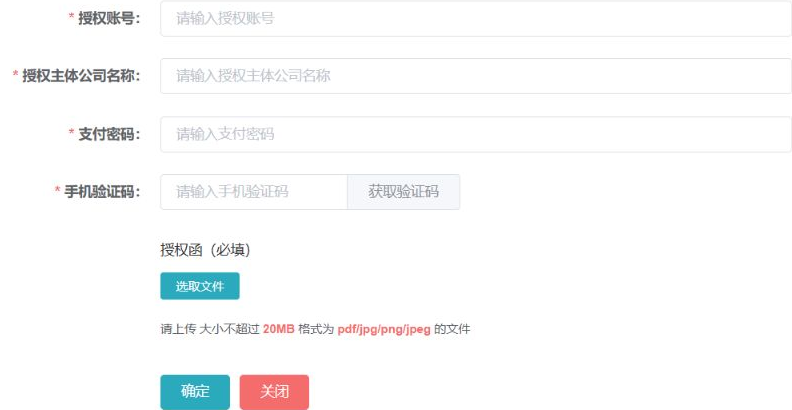
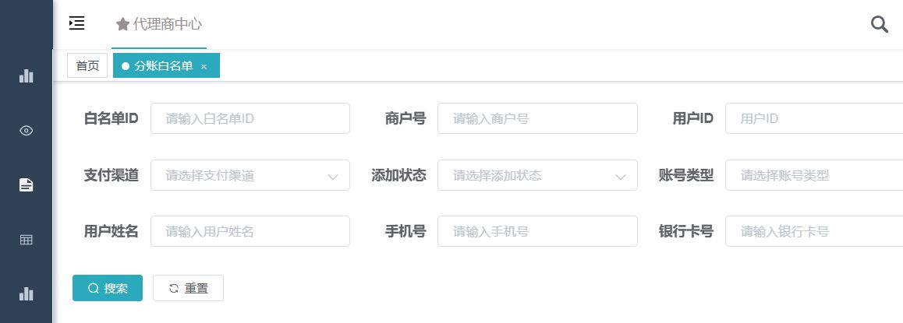

## ADDED Requirements

### Requirement: Sensitive fields are encrypted at rest
**Trace ID:** NFR-SEC-001, FR-SEC-004

The system MUST encrypt complete identity numbers, bank account numbers, mobile numbers, and other configured sensitive fields before persistence using approved algorithms and externally managed versioned keys.

#### Scenario: Persist KYC identity number
- **GIVEN** a valid complete identity number is submitted through an authorized KYC command
- **WHEN** the KYC version is persisted
- **THEN** the database stores ciphertext, key version, masked display value, and any separately approved uniqueness hash rather than plaintext

### Requirement: Sensitive uniqueness uses non-reversible indexes
**Trace ID:** SEC-002

Where equality or uniqueness lookup is required, the system SHALL use normalized keyed hash or an approved deterministic index separate from encrypted display data and SHALL NOT expose the hash to clients.

#### Scenario: Detect duplicate legal identifier
- **GIVEN** an existing merchant has the same normalized legal identifier
- **WHEN** another merchant creation checks uniqueness
- **THEN** the system detects the duplicate without decrypting every merchant record

### Requirement: Responses are masked by default
**Trace ID:** AC-COM-003, FR-WHT-003

All ordinary list, detail, task, notification, report, and export-preview responses SHALL return configured masked forms of identity, bank account, and mobile fields, and unauthorized endpoints MUST NOT receive complete values from the service layer.

#### Scenario: Reviewer opens task summary
- **GIVEN** a reviewer has task access but no privileged reveal permission
- **WHEN** task business data is requested
- **THEN** identity, bank account, and mobile fields are masked in the server response

### Requirement: Privileged reveal requires step-up authorization
**Trace ID:** FR-SEC-001, SEC-003

The system SHALL require independent permission, current business scope, reason, and configured step-up authentication before returning a complete sensitive value, and SHALL make the response non-cacheable.

#### Scenario: Reveal complete bank account number
- **GIVEN** an authorized reviewer has a legitimate review task
- **WHEN** the reviewer supplies a reason and passes step-up authentication
- **THEN** the system returns the value for the minimum required duration and writes an immutable reveal audit record

#### Scenario: Reveal outside task scope
- **GIVEN** a user has generic reveal permission but no access to the merchant
- **WHEN** the user requests a complete value
- **THEN** the service denies the request and records the attempt

### Requirement: KYC attachments remain private
**Trace ID:** FR-ONB-005, FR-SEC-007

The system SHALL keep KYC and authorization attachments in private storage, SHALL issue only short-lived authorized access, and MUST enforce server-side type validation, size limit, hash, malware scan, and access audit.

#### Scenario: Open attachment from expired URL
- **GIVEN** an attachment access URL has expired
- **WHEN** it is reused
- **THEN** storage denies access and the user must request a newly authorized reference

### Requirement: Flowable variables use an allowlist
**Trace ID:** SEC-ONB-001

The workflow adapter MUST enforce an allowlist of process-variable names and types and SHALL reject raw identity numbers, bank account numbers, mobile numbers, passwords, KYC JSON, binary content, and permanent attachment URLs.

#### Scenario: Attempt to start workflow with full KYC DTO
- **GIVEN** a caller supplies a serialized KYC object as a process variable
- **WHEN** the workflow adapter validates the command
- **THEN** workflow start is rejected before any Flowable runtime or history variable is written

### Requirement: Request, response, and error logs are sanitized
**Trace ID:** NFR-SEC-003, NFR-AUD-001

KYC, password, bank-account, channel, attachment, and privileged-reveal endpoints MUST exclude bodies from generic access logging or apply field-level sanitization before persistence; error messages and traces MUST NOT contain sensitive values or secrets.

#### Scenario: Channel submission fails validation
- **GIVEN** a channel request contains complete KYC data in controlled memory
- **WHEN** request construction throws an exception
- **THEN** logs contain application ID, version, trace ID, and sanitized error category but no complete sensitive field

### Requirement: Security audit is immutable and queryable
**Trace ID:** AC-COM-006

The system MUST audit create, edit, reveal, attachment view, workflow action, channel submission, export, lifecycle, credential, and key operations with actor, tenant, agent scope, object, business version, action, reason, timestamp, IP, result, and sanitized before/after values.

#### Scenario: Audit attachment access
- **GIVEN** a reviewer opens a KYC attachment
- **WHEN** access is granted
- **THEN** an audit event records reviewer, task/application, object ID, file hash, time, IP, and result without storing the attachment contents

### Requirement: Exports require separate control
**Trace ID:** FR-WHT-005, AC-ORD-005

Sensitive-data export SHALL require a distinct permission and configured approval policy, SHALL respect active filters and data scope, SHALL mask fields unless explicitly approved, and SHALL produce a watermarked, encrypted or access-controlled, expiring artifact with download audit.

#### Scenario: Export without sensitive-export permission
- **GIVEN** a user can view masked merchant data but lacks export permission
- **WHEN** the export endpoint is called directly
- **THEN** the service rejects the request

### Requirement: Credentials and keys are externalized
**Trace ID:** NFR-SEC-002

Database passwords, Redis passwords, field-encryption keys, API encryption keys, channel private keys, certificates, SMS credentials, and object-storage secrets MUST be supplied through an approved secret-management mechanism and SHALL NOT use repository defaults in production.

#### Scenario: Production starts with placeholder key
- **GIVEN** production configuration resolves to a known placeholder or missing required key
- **WHEN** the application starts
- **THEN** startup fails closed with a non-secret diagnostic message

### Requirement: Retention and deletion are policy-driven
**Trace ID:** SEC-004

The system SHALL define retention for KYC versions, Flowable history, audit events, channel payload evidence, exports, and attachments, and SHALL implement legal hold, expiry, archival, and cryptographic deletion where required.

#### Scenario: Export reaches expiry
- **GIVEN** a generated export has exceeded its permitted lifetime and no legal hold applies
- **WHEN** cleanup runs
- **THEN** the artifact becomes inaccessible and deletion is auditable

### Requirement: Password inputs and session changes are protected
**Trace ID:** FR-SEC-002, FR-SEC-003, FR-SEC-005, FR-SEC-008

Login and payment password inputs MUST use protected input types, passwords MUST be independently hashed and rate-limited, and password reset, agent disablement, or material permission changes SHALL revoke affected sessions according to policy.

#### Scenario: Payment password entry
- **GIVEN** a payment-password step is displayed
- **WHEN** the user enters the password
- **THEN** the browser masks it and the value is not stored in browser persistence, Flowable variables, access logs, or analytics
